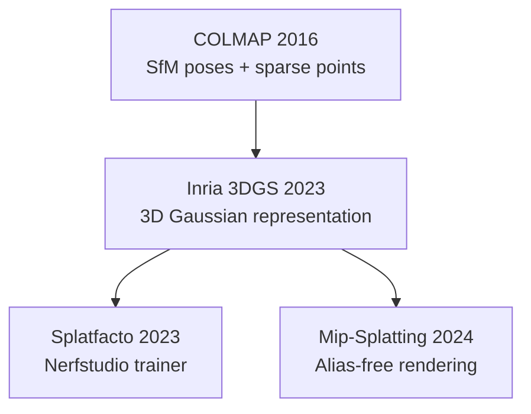

# 3D Gaussian Splatting SOTA Comparison — Study Scope

This document defines the scope, methods, datasets, metrics, and defensible claims for an empirical comparison of open-source 3D Gaussian Splatting (3DGS) trainers. It supersedes the PhotoWalk / casual phone-capture experiment narrative for the research report.

---

## 1. Purpose and Non-Goals

### Purpose

We conduct a **reproducible empirical benchmark** of three open-source 3DGS training implementations on a standard COLMAP dataset, under **Google Colab T4 GPU** constraints, with a fixed budget of **10,000 optimization iterations** per method.

The study answers: *Under equal data, poses, and iteration budget, how do Splatfacto, the original Inria 3DGS trainer, and Mip-Splatting compare in image quality metrics and training efficiency?*

### Non-Goals

The following are **explicitly out of scope** for this report:

- Custom phone capture or PhotoWalk-style deployment
- DUSt3R, MASt3R, InstantSplat, or other pose-free / few-view pipelines
- NeRF baselines (Instant-NGP, Mip-NeRF 360) as primary comparisons
- Commercial tools (PostShot, Polycam, Luma)
- Novel algorithms or architectural contributions
- Geometry benchmarks (DTU Chamfer, mesh accuracy)

---

## 2. Models Under Test

We evaluate exactly **three** methods. All share the same high-level pipeline: **COLMAP poses + sparse points → optimize 3D Gaussians → export PLY → evaluate on held-out views**.

### 2.1 Selected Models

| Model | Implementation | Citation | Role in Study |
|-------|----------------|----------|---------------|
| **Nerfstudio Splatfacto** | `ns-train splatfacto` via [colab_training.ipynb](../colab_training.ipynb) | Tancik et al., SIGGRAPH 2023 (framework); Kerbl et al., 2023 (method) | **Baseline** — production-oriented wrapper already integrated in our Colab workflow |
| **Inria 3DGS** | [graphdeco-inria/gaussian-splatting](https://github.com/graphdeco-inria/gaussian-splatting) | Kerbl et al., SIGGRAPH 2023 | **Canonical reference** — original paper implementation; defines what "3DGS" means |
| **Mip-Splatting** | [autonomousvision/mip-splatting](https://github.com/autonomousvision/mip-splatting) | Yu et al., CVPR 2024 | **Quality follow-up** — same Gaussian representation with alias-free rendering; tests whether 2024 improvements matter at 10k iters |

### 2.2 Rationale Summary

- **Splatfacto** represents what practitioners actually run (Nerfstudio CLI, export to `.ply`, Colab-friendly). Comparing it to Inria answers whether the framework changes quality or speed versus the reference code.
- **Inria 3DGS** is required for any credible 3DGS comparison; all follow-up papers benchmark against it.
- **Mip-Splatting** is the most relevant fast-training follow-up in the same COLMAP-in family; it targets aliasing and flicker without changing the overall scene representation.

All three are feasible on a **T4 in roughly 7–20 minutes** at 10k iterations when using precomputed COLMAP geometry.

### 2.3 Method Hierarchy

**Evolution in plain terms:**

1. **COLMAP** estimates where cameras were and a sparse point cloud (no learned scene yet).
2. **Inria 3DGS** replaces NeRF-style ray marching with millions of optimizable 3D Gaussians and real-time splatting.
3. **Splatfacto** implements the same idea inside Nerfstudio for easier training and export.
4. **Mip-Splatting** keeps Gaussians but improves how they are filtered at different scales to reduce shimmer and aliasing.

### 2.4 Excluded Models (Brief)

| Excluded | Reason |
|----------|--------|
| DUSt3R / MASt3R / InstantSplat | Different pipeline (pose-free or few-view); not a fair 3DGS trainer comparison |
| 2D Gaussian Splatting, Scaffold-GS, AbsGS | Heavier setup and tuning; risky for single-day T4 runs |
| Instant-NGP / Plenoxels | NeRF/voxel family, not Gaussian splats |
| Commercial apps | Not open-source or reproducible for academic citation |

---

## 3. Dataset

### 3.1 Primary (Only) Benchmark Scene: gerrard-hall

| Property | Value |
|----------|-------|
| **Name** | gerrard-hall |
| **Source** | [COLMAP official release](https://github.com/colmap/colmap/releases) (`gerrard-hall.zip`, ~960 MB) |
| **Content** | ~100 outdoor building images + precomputed COLMAP `sparse/` reconstruction |
| **Local path** | [scenes/gerrard-hall/](../scenes/gerrard-hall/) (`gerrard-hall/images/`, `gerrard-hall/sparse/`) |
| **Scene type** | Unstructured photo collection, medium outdoor facade |

### 3.2 Why gerrard-hall Only

- **Reproducibility:** Public download; any reviewer or teammate can rerun.
- **Fair comparison:** Fixed images and poses; differences reflect **trainers**, not capture quality.
- **Existing infrastructure:** [colab_training.ipynb](../colab_training.ipynb) already downloads and trains Splatfacto on this scene; a prior run exported ~73.5 MB `splat.ply` at 10k iterations.
- **Resource fit:** One scene × three methods fits a single Colab day on T4.

We do **not** use custom photographs for the main comparison table.

### 3.3 Train / Test Split for Metrics

Following the protocol used in **Kerbl et al. (2023)** and **Mip-NeRF 360**:

- **Training views:** all images except every 8th frame (by sorted filename / frame index).
- **Test views:** every **8th** image (held out during training; used only for PSNR / SSIM / LPIPS).

**Note:** The COLMAP release provides poses for all images. Each trainer must respect the same train/test partition in its dataloader or eval script. If a method trains on all views by default, eval numbers are not comparable — configure or post-hoc render on test indices only.

### 3.4 Fairness Constraints (Locked Across All Methods)

| Knob | Value |
|------|-------|
| Scene | gerrard-hall |
| Camera poses | Same precomputed `sparse/0/` (no re-running COLMAP per method) |
| Iterations | **10,000** |
| Image resolution | Native dataset resolution (or same max edge if downscaling is applied — apply equally) |
| GPU | Colab **T4** (15 GB VRAM) |
| Export | Gaussian `.ply` per method |

### 3.5 Colab Execution Note

Run **Splatfacto** in one notebook session ([colab_training.ipynb](../colab_training.ipynb)). Run **Inria 3DGS** and **Mip-Splatting** in a **second** session to avoid PyTorch / CUDA extension conflicts between Nerfstudio and the Inria `diff-gaussian-rasterization` build.

---

## 4. Metrics

Metrics align with **Kerbl et al. (2023)** and **Yu et al. (2024)** for novel view synthesis. We do not use mesh-based geometry metrics.

### 4.1 Tier A — Image Quality (Primary)

Computed on **held-out test views** only (every 8th image). Render test cameras from the trained model; compare to ground-truth photographs.

| Metric | Direction | Definition (brief) |
|--------|-----------|-------------------|
| **PSNR** | Higher is better | Peak signal-to-noise ratio (pixel error) |
| **SSIM** | Higher is better | Structural similarity |
| **LPIPS** | Lower is better | Learned perceptual patch similarity |

These three are the standard trio used in the originating papers to claim accurate **view synthesis**, not mesh reconstruction.

### 4.2 Tier B — Efficiency (Secondary)

Reported alongside quality, following Kerbl Table 1 style. These support **practical** claims, not "more accurate scene representation" alone.

| Metric | Direction | Notes |
|--------|-----------|-------|
| **Training wall-clock** | Lower is faster | Log start/end on T4 |
| **Peak GPU memory** | Lower is better | `nvidia-smi` or framework logs |
| **Number of Gaussians** | Context-dependent | From export / training logs |
| **PLY file size (MB)** | Lower is smaller | Post-export on disk |

### 4.3 Tier C — Supplementary (Optional)

Not used for paper-style SOTA claims; useful for figures and discussion.

| Metric | Use |
|--------|-----|
| **Qualitative rubric (1–5)** | Five criteria × three methods, fixed viewpoints in SuperSplat |
| **Rendering FPS** | If easily logged from viewer |

**Qualitative criteria:** completeness, sharpness, floaters, view consistency, aliasing/flicker.

### 4.4 Out of Scope

- Chamfer distance, DTU F1, depth-map metrics (geometry-focused papers)
- PhotoWalk `validate_images.py` blur scores as primary outcomes (input QC only, if mentioned at all)

---

## 5. Limits of Extrapolation at 10,000 Iterations

Our budget is **10k iterations** for T4 feasibility. The **Inria 3DGS paper** (Kerbl et al., arXiv:2308.04079) trains at multiple budgets:

| Iterations (Kerbl, real scenes) | Train time (order of) | Quality level (paper) |
|---------------------------------|----------------------|------------------------|
| **7K** | ~5–7 min | Close to Instant-NGP; **below** full NeRF SOTA |
| **10K (ours)** | ~7–10 min | Between 7K and 30K; **quick convergence checkpoint** |
| **30K** | ~35–45 min | Matches or slightly **beats Mip-NeRF 360** on benchmarks |

### 5.1 Claims We Can Make at 10k

| Allowed claim |
|---------------|
| Relative **ranking among the three implementations** on gerrard-hall at equal iterations |
| **Efficiency** tradeoffs: train time, VRAM, Gaussian count, PLY size |
| Whether renders are **visually usable** for interactive viewing |
| **Visual** differences in aliasing (especially Mip-Splatting vs Inria), supported by screenshots |
| **Negative results:** "no significant metric difference" between Splatfacto and Inria |

### 5.2 Claims We Cannot Make at 10k

| Disallowed claim |
|------------------|
| "Our 3DGS run **beats Mip-NeRF 360**" (paper uses **30k** + full benchmark suite for that) |
| Paper-exact PSNR tables without matching their resolution, split, and iteration count |
| "10k is fully converged" for all scenes |
| Generalization to **all** Mip-NeRF 360 or Tanks & Temples scenes from one building |
| Global "state-of-the-art" without multi-scene, multi-iteration evidence |

**Framing sentence for the report:**  
*This study is an **implementation comparison under a fixed low iteration budget** on a single benchmark scene, not a reproduction of full paper SOTA at 30k iterations.*

---

## 6. Realistic Conclusions the Report Can Support

Use conditional language until numbers are filled in. The following are **defensible** outcome types:

1. **Splatfacto vs Inria:** At 10k on gerrard-hall, PSNR/SSIM/LPIPS are expected to be **close**; large gaps would indicate implementation or hyperparameter differences worth reporting.
2. **Mip-Splatting vs Inria:** Mip-Splatting may show **similar aggregate metrics** with **better anti-aliasing** on zoom/motion (qualitative or LPIPS edge cases); train time may be slightly higher.
3. **Cost–quality:** Tabulate minutes vs PLY size vs metric delta; e.g. "Mip-Splatting adds X minutes for Y LPIPS improvement."
4. **Iteration vs trainer:** If all three cluster tightly, conclude that **iteration budget matters more than trainer choice** at 10k for this scene.
5. **Negative results:** If metrics agree within measurement noise, report that **no method dominates** — a valid empirical finding for a course project.

Do **not** conclude which method is "best globally"; conclude which is **best for T4 + 10k + gerrard-hall** under our protocol.

---

## 7. Research Impact

### 7.1 Contribution Type

**Reproducible empirical benchmark** under resource constraints — not a new algorithm.

### 7.2 Impact

- Makes the 3DGS **lineage** (Inria → Nerfstudio Splatfacto → Mip-Splatting) concrete for students and practitioners choosing a stack on **free Colab T4**.
- Documents a **metric protocol** (PSNR, SSIM, LPIPS + efficiency) aligned with Kerbl and Yu, so results are comparable in spirit to the literature.
- Clarifies **when 10k training is meaningful** versus when papers' **30k** claims apply — reduces misinterpretation of "quick Colab runs" as full SOTA.
- Provides an open Colab path ([colab_training.ipynb](../colab_training.ipynb)) and empty tables below for reruns and extensions.

### 7.3 Limitations (State in Report)

- Single scene (gerrard-hall)
- Single GPU tier (T4)
- Single iteration budget (10k)
- No novel method
- Qualitative scores are supplementary, not primary evidence

---

## 8. Execution Checklist

- [ ] Enable Colab T4 GPU
- [ ] Download / verify gerrard-hall (`images/`, `sparse/0/`)
- [ ] **Session A:** Run [colab_training.ipynb](../colab_training.ipynb) — Splatfacto, `MAX_ITERATIONS = 10000`, export PLY
- [ ] **Session B:** Install and train Inria 3DGS — 10k iters, same data layout
- [ ] **Session B:** Install and train Mip-Splatting — 10k iters, same data layout
- [ ] Eval: PSNR / SSIM / LPIPS on held-out every-8th views for all three
- [ ] Log train time, peak VRAM, Gaussian count, PLY size
- [ ] Capture side-by-side test renders + SuperSplat screenshots
- [ ] Fill tables in Section 9
- [ ] Optional: copy summary rows to `experiments.json` or future `report/sota_results.md`

---

## 9. Results Tables (Fill After Colab Runs)

### 9.1 Tier A — Image Quality (gerrard-hall, test views)

| Method | PSNR ↑ | SSIM ↑ | LPIPS ↓ | Notes |
|--------|--------|--------|---------|-------|
| Splatfacto (10k) | | | | |
| Inria 3DGS (10k) | | | | |
| Mip-Splatting (10k) | | | | |

### 9.2 Tier B — Efficiency (T4, 10k iterations)

| Method | Train time (min) | Peak VRAM (GB) | # Gaussians | PLY size (MB) |
|--------|------------------|----------------|-------------|---------------|
| Splatfacto (10k) | | | | |
| Inria 3DGS (10k) | | | | |
| Mip-Splatting (10k) | | | | |

### 9.3 Tier C — Qualitative Rubric (1 = poor, 5 = excellent)

| Method | Completeness | Sharpness | Floaters | View consistency | Aliasing | **Total /25** |
|--------|--------------|-----------|----------|------------------|----------|---------------|
| Splatfacto (10k) | | | | | | |
| Inria 3DGS (10k) | | | | | | |
| Mip-Splatting (10k) | | | | | | |

### 9.4 Summary Findings (Draft After Experiments)

1. **Best PSNR/SSIM/LPIPS on gerrard-hall at 10k:**
2. **Fastest training:**
3. **Smallest export:**
4. **Main visual difference (aliasing / floaters / sharpness):**
5. **One-sentence conclusion (scoped to 10k + gerrard-hall):**

---

## References (Key)

- Kerbl, B., Kopanas, G., Leimkühler, T., & Drettakis, G. (2023). *3D Gaussian Splatting for Real-Time Radiance Field Rendering.* ACM TOG (SIGGRAPH). arXiv:2308.04079.
- Yu, Z., et al. (2024). *Mip-Splatting: Alias-free 3D Gaussian Splatting.* CVPR.
- Tancik, M., et al. (2023). *Nerfstudio: A Modular Framework for Neural Radiance Field Development.* ACM SIGGRAPH.
- Schönberger, J. L., & Frahm, J.-M. (2016). *Structure-from-Motion Revisited.* CVPR.
- Barron, J. T., et al. (2022). *Mip-NeRF 360: Unbounded Anti-Aliased Neural Radiance Fields.* CVPR.

See also [related_work.md](related_work.md) for draft prose.
